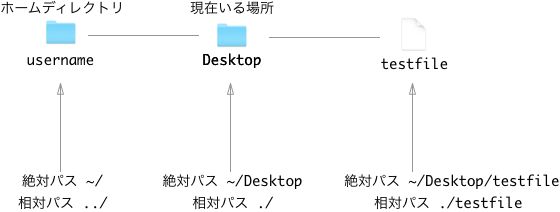
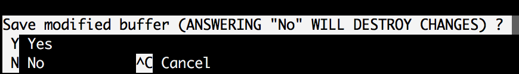

# コマンドライン入門(Win編)

## 目的

- コマンドラインとは何かを理解する。
- 基本的なコマンドを理解し、実際に使ってみる。

## コマンドラインとは

コマンドラインとはコマンドラインインターフェースの略語でCLI(**C**ommand **L**ine **I**nterface)とも呼ばれます。プログラマーが黒い画面を開いて作業をしているのや、映画などで凄腕プログラマが黒い画面に色々書いているのを見たことがあるかもしれませんが、それがコマンドラインです。

## Git Bashについて

Windowsにおいては、Powershellというコマンドラインが初期でインストールされています。このコマンドラインはとてもパワフルです。ただしMacやLinuxで通常利用するBashというコマンドラインツールとは異なるコマンドが多くあります。
CodeGritでは、メンターの多くがBashに慣れていることもあり、PowershellではなくGit Bashというツールを利用します。

## Git Bashのインストール

Git BashはGitというソフトをインストールすると付属してきます。そのため、まずは以下のページよりGitをダウンロードし、インストールを行いましょう。

[Downloading Git](https://git-scm.com/download/win)

## コマンドラインは怖くない

特に映画でいわゆるハッカーがコマンドラインを使っていることから、コマンドラインについて難しそうなイメージを持っている方も多かもしれません。しかし、実際には普通の人がマウスでクリックして行っていることを、マウスを動かすのが面倒だからテキストベースでそのファイルまで移動して、同じような操作をしているだけだったりします。もちろん知識がないと出来ない操作もあったりはしますが、最初からそうした知識を身につける必要はなく、基本的な操作だけ知っていれば十分です。今回のレッスンではその基本を学んでいきましょう。

## 開いてみよう

Windowsのデスクトップ上左下の検索ツールで"Git Bash"と入力するとGit Bashが出てくるはずです。この時に、Git Bashの上で右クリックを押して、"Run as administrator"を選んでください。すると管理者としてGit Bashを開くことが出来ます。

すると以下のような画面が開きます。


Macの場合は最初に立ち上げた時黒い画面ではなく白い画面です。プログラマらしく見せたい場合は、環境設定からテーマを変更してから再起動してみてください。

## 初めてのコマンド

ターミナルが無事に立ち上がったら次のコマンドを入力してみましょう。

```
$ whoami
```

すると現在のユーザー名が表示されるはずです。

## 事前知識

さて、ここからコマンドの説明に入っていくのですが、その前に知っておいて欲しい2つの基礎知識を説明していきます。

### ホームディレクトリ

コマンドラインを開いた時に最初にいる場所を**ホームディレクトリ**と呼ぶ。コンピュータでは慣習的にこのホームディレクトリのことを`~`と表します。

### 相対パスと絶対パス

コンピュータでは、現在居るディレクトリから見た、他のファイルやフォルダの場所のことを**相対パス**と呼びます。逆に、ホームディレクトリから見たある場所のことを**絶対パス**と呼びます。

例えばGit Bashでは`/c/Users/username`がホームディレクトリとなっています。(usernameの部分は自分で付けたユーザーネームが入ってます)

usernameのディレクトリ直下には"Desktop"、"Documents"などのフォルダがあります。今回はこの"Desktop"フォルダ内に"testfile"というファイルがあった場合を想像して絶対パスと相対パスを説明していきます。



仮に現在自分がDesktopにいるとしましょう。この時、今居るディレクトリの絶対パスは`~/Desktop`となっています。逆に相対パスは今自分のいる場所で、これを`./`と表します。

現在いるデスクトップから見たときのホームディレクトリはどうでしょう。これは一回層上のディレクトリとなります。この1回層上のディレクトリは`../`で表します。

この`../`は重ねることが出来ます。例えば三段階上のディレクトリを示したければ`../../../`と`../`を三回繰り返すことで表現できます。

次にtestfileの場所を見ていきましょう。このファイルの絶対パスは`~/Desktop/testfile`となります。相対位置もほぼ同じで、`./testfile`となります。この時`./`は省略することが出来、`testfile`とだけ書くことも出来ます。


## 最初に知っておいて欲しいコマンド

自分のユーザー名を表示するだけだとあまり有用性がないので、有用性の高いコマンドを学んでいきましょう。全部で11個なので、頑張って使っているとすぐに慣れて自然にコマンドが頭に浮かぶようになるはずです。

### pwd

pwd(**P**rint **W**orking **D**irectory)を使うと現在自分がどのディレクトリにいるかを知ることが出来ます。最初にターミナルを開いた時はホームディレクトリに居ますので、Macの場合でしたら以下のように表示されるでしょう。

```
$ pwd
/c/Users/user_name
```

### cd

cd(**C**hange **D**irectory)を使うとホームディレクトリに戻ることが出来ます。例えば、現在のディレクトリがDesktopだとしましょう。すると次のようになりあす。

```
$ pwd
/c/Users/user_name/Desktop
$ cd
$ pwd
/c/Users/user_name
```

### cd + ディレクトリ

`cd`のみであれば、ホームディレクトリに戻りますが`cd ディレクトリ`で他のディレクトリへ移動することが出来ます。例えばDesktopに移動したい場合は以下のようにします。

```
$ pwd
/c/Users/username
$ cd Desktop
$ pwd
/c/Users/username/Desktop
```

また試しに、`De`まで入力した後に`tab`をクリックして見て下さい。すると自分で全部を入力しなくても`Desktop`と入るはずです。

### ls

`ls`(lists)は、指定したディレクトリ内のファイルやフォルダを見るために利用します。lsの後に何も入力しなければ現在いるディレクトリのファイルやフォルダを見ることが出来ます。例えばホームディレクトリであれば以下のように表示されるはずです。

```
$ cd Desktop
$ pwd
/c/Users/username/Desktop
$ ls
desktop.ini  test/  testDir/
$ ls testDir
test.txt
```

### mkdir

`mkdir`(**M**ake **D**irectory)を利用すると、新しいディレクトリ(フォルダ)を作成することが出来ます。

```
$ pwd
/c/Users/username
$ mkdir test
$ cd test
$ pwd
/Users/username/test
$ ls
$ 

空なので何も表示されません。
```

### touch

`touch`を利用すると、新しいファイルを作成することが出来ます。

```
$ pwd
/Users/user_name/test
$ ls
$ touch test.md
$ ls
test.md
```

### nano

ターミナル内でnanoというエディタを立ち上げることが出来ます。ちょっとファイルを編集したいという場合に便利です。

```
$ nano test.md
```

すると以下のような画面に変わります。


何かを入力してみましょう。


`control + X`を押すと以下のような文章が出ます。



ここで、"Shift + Y"(大文字のY)で保存ができます。

### cat

cat(Con**cat**enate)はファイルの中身を見たい時に利用します。例えば、先ほど作成した"test.md"を見てみましょう

```
$ ls
test.md
$ cat test.md
これはテストです。
```

このようにファイルをエディタなどで開くのが面倒だと言う時にcatはとても便利です。

### mv

mv(**M**o**v**e)はファイルを別の場所に移したい時に利用します。例えば、現在"test.md"のファイルがホームディレクトリにありますが、これをDesktopに移したいとします。

```
$ pwd
/c/Users/user_name/test
$ ls
test.md
$ mv test.md ../Desktop
$ ls
$
$ ls ../Desktop
test.md
```

このように、ファイルがtestフォルダから消えて、Desktopに移動したことが分かります。

### cp

cp(**C**o**p**yはファイルをコピーしたい時に利用します。例えば先ほどDesktopに移したtest.mdファイルをコピーしてtest2.mdというファイルを作ってみましょう。

```
$ cd ../Desktop
$ ls
test.md
$ cp test.md test2.md
$ ls
test.md test2.md
```

### rm

さて、テストファイルを勉強目的に作ってみましたが、今後使わないので消してしまいましょう。このときにはrm(**R**e**m**ove)コマンドを使います。

```
$ ls
test.md test2.md
$ rm test.md test2.md
$ ls
$
ファイルが削除されたため何も表示されません。
```

### rm -r

さて、ファイルを削除しましたが、ホームディレクトリ直下に作成した"test"フォルダがまだ残っています。これを消したいときは`rm`に`-r`というオプションを付けます。

```
$ cd
$ ls
... test
$ rm -r test
$ ls
... 
testフォルダが消えます。
```

## CodeGritでコマンドラインをどう使っていくのか

プログラミングスクールの中には、初心者にとっつきにくいコマンドラインの利用や、バージョン管理のシステム、を避けているところも少なくありません。CodeGritでは、学習者が将来的にプロの開発者となることを想定してコースを作成しているため、あえて避けずにコマンドラインを事前コースに含んでいます。

今回習ったコマンドラインについては、例えばGitというプログラマほぼ全員の使っているバージョン管理システムを使う場合や、Javascriptのようなプログラミング言語を学習する際にも頻繁に使っていきます。このレッスンだけで全て使いこなせるようになっていなくても学習の中でどんどん身に付いていきますので安心してください。

## まとめ

ここまでで、コマンドラインの基礎を抑えることが出来ました。今後コマンドラインに慣れていったら、他のコマンドやオプションを使う機会が増えていくかと思います。その都度新しい知識を身に着けてコマンドラインのエキスパートとなっていきましょう。

## 更に学ぼう

### 動画で学ぶ

[UNIXコマンド入門 [一般ユーザー編] - ドットインストール](https://dotinstall.com/lessons/basic_unix_v2)

### 記事で学ぶ

[UNIXコマンドの使い方](http://www.gi.ce.t.kyoto-u.ac.jp/user/susaki/command/)