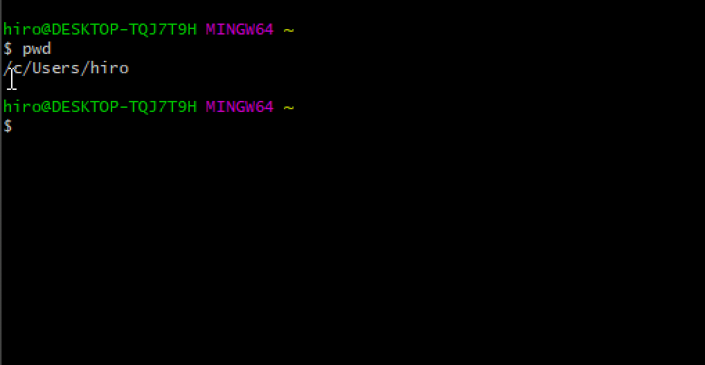
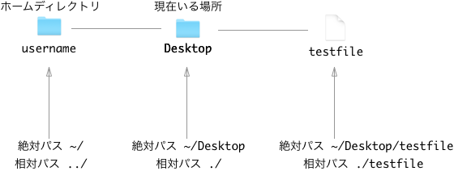

## コマンドラインとは

コマンドラインとはコマンドラインインターフェースの略語でCLI(**C**ommand **L**ine **I**nterface)とも呼ばれます。プログラマーが黒い画面を開いて作業をしているのや、映画などで凄腕プログラマが黒い画面に色々書いているのを見たことがあるかもしれませんが、それがコマンドラインです。

## Git Bashについて

Windowsにおいては、Powershellというコマンドラインが初期でインストールされています。このコマンドラインはとてもパワフルです。ただしMacやLinuxで通常利用するBashというコマンドラインツールとは異なるコマンドが多くあります。
CodeGritでは、メンターの多くがBashに慣れていることもあり、PowershellではなくGit Bashというツールを利用します。

## Git Bashのインストール

Git BashはGitというソフトをインストールすると付属してきます。そのため、まずは以下のページよりGitをダウンロードし、インストールを行いましょう。

[Downloading Git](https://git-scm.com/download/win)

## コマンドラインは怖くない

特に映画でいわゆるハッカーがコマンドラインを使っていることから、コマンドラインについて難しそうなイメージを持っている方も多かもしれません。しかし、実際には普通の人がマウスでクリックして行っていることを、マウスを動かすのが面倒だからテキストベースでそのファイルまで移動して、同じような操作をしているだけだったりします。もちろん知識がないと出来ない操作もあったりはしますが、最初からそうした知識を身につける必要はなく、基本的な操作だけ知っていれば十分です。今回のレッスンではその基本を学んでいきましょう。

## 開いてみよう

Windowsのデスクトップ上左下の検索ツールで"Git Bash"と入力するとGit Bashが出てくるはずです。この時に、Git Bashの上で右クリックを押して、"Run as administrator"を選んでください。すると管理者としてGit Bashを開くことが出来ます。

すると以下のような画面が開きます。



Macの場合は最初に立ち上げた時黒い画面ではなく白い画面です。プログラマらしく見せたい場合は、環境設定からテーマを変更してから再起動してみてください。

## 初めてのコマンド

ターミナルが無事に立ち上がったら次のコマンドを入力してみましょう。

```
$ whoami
```

すると現在のユーザー名が表示されるはずです。

## 事前知識

さて、ここからコマンドの説明に入っていくのですが、その前に知っておいて欲しい2つの基礎知識を説明していきます。

### ホームディレクトリ

コマンドラインを開いた時に最初にいる場所を**ホームディレクトリ**と呼ぶ。コンピュータでは慣習的にこのホームディレクトリのことを`~`と表します。

### 相対パスと絶対パス

コンピュータでは、現在居るディレクトリから見た、他のファイルやフォルダの場所のことを**相対パス**と呼びます。逆に、ホームディレクトリから見たある場所のことを**絶対パス**と呼びます。

例えばGit Bashでは`/c/Users/username`がホームディレクトリとなっています。(usernameの部分は自分で付けたユーザーネームが入ってます)

usernameのディレクトリ直下には"Desktop"、"Documents"などのフォルダがあります。今回はこの"Desktop"フォルダ内に"testfile"というファイルがあった場合を想像して絶対パスと相対パスを説明していきます。



仮に現在自分がDesktopにいるとしましょう。この時、今居るディレクトリの絶対パスは`~/Desktop`となっています。逆に相対パスは今自分のいる場所で、これを`./`と表します。

現在いるデスクトップから見たときのホームディレクトリはどうでしょう。これは一回層上のディレクトリとなります。この1回層上のディレクトリは`../`で表します。

この`../`は重ねることが出来ます。例えば三段階上のディレクトリを示したければ`../../../`と`../`を三回繰り返すことで表現できます。

次にtestfileの場所を見ていきましょう。このファイルの絶対パスは`~/Desktop/testfile`となります。相対位置もほぼ同じで、`./testfile`となります。この時`./`は省略することが出来、`testfile`とだけ書くことも出来ます。